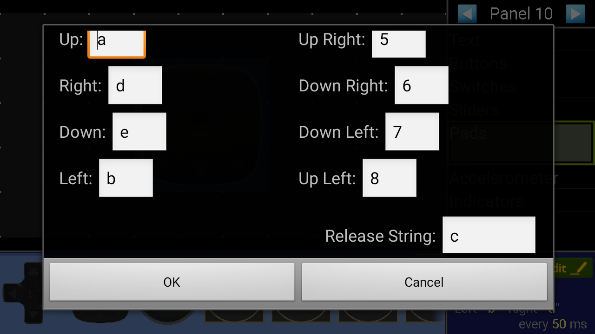
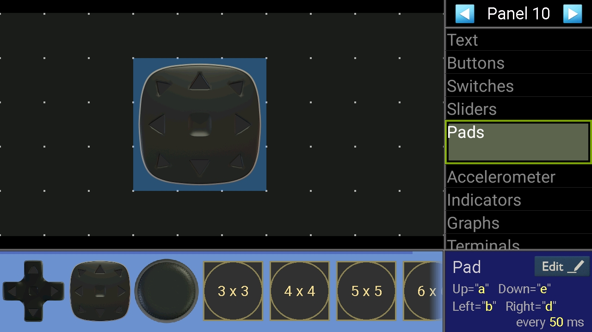

# Carro Futbolero

Es un proyecto de carros que se controlan por bluetooth

1. Descargar de play store bluetooth electronics
   link: https://play.google.com/store/apps/details?id=com.keuwl.arduinobluetooth&hl=es_BO
2. Configurar segun la imagen en la app:
    
   
    
   
    
